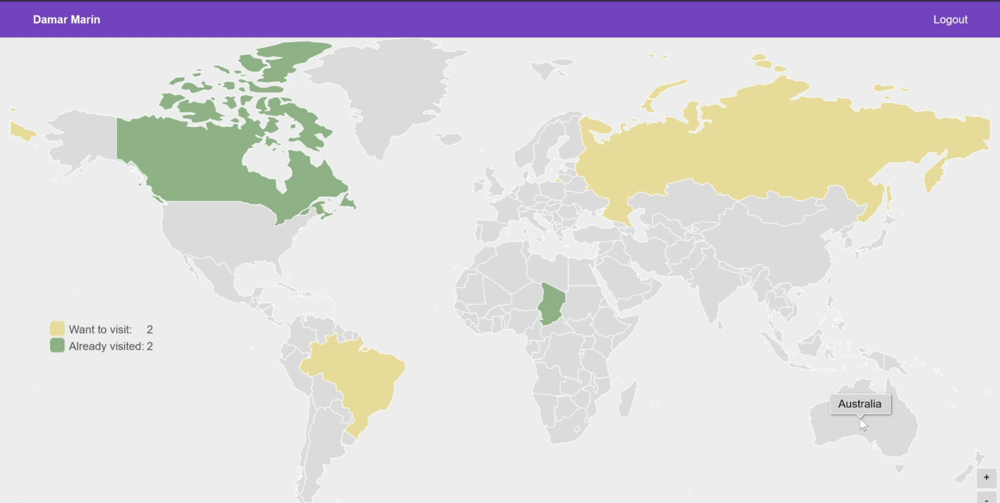

<h1 align="center">
  🗺️ Mapa de Viajes Interactivo · 🌍
</h1>

<table border="0">
  <tr>
    <td align="center">
      Un rastreador de viajes personal que permite a los usuarios visualizar su historial de viajes y metas en un mapa mundial interactivo. Desarrollado con Datomic y Clojure, esta aplicación permite a los usuarios colorear los países que han visitado, marcar destinos que desean visitar y guardar su progreso en sus cuentas. ¡Perfecto para entusiastas de los viajes y aventureros!
    </td>
    <td align="center">
      Video demostrativo
      
    </td>
  </tr>
</table>

## Tecnologías Utilizadas

- [Datomic](https://www.datomic.com) para el almacenamiento persistente de datos
- [Clojure](https://clojure.org) para la lógica del backend
- [Leiningen](https://leiningen.org) para la gestión del proyecto
- [amCharts](https://www.amcharts.com) para la visualización interactiva del mapa
- [Reagent](https://reagent-project.github.io) para el frontend en ClojureScript

## Características Principales

- Mapa mundial interactivo para marcar países visitados y deseados
- Cuentas de usuario con almacenamiento persistente en Datomic
- Visualización con códigos de colores:
  - 🟢 Países visitados
  - 🟡 Países por visitar
  - ⚪️ Países no explorados
- Guardar y cargar el progreso de viajes
- Diseño responsive para escritorio y móviles

## Captura de Pantalla

## Requisitos Previos

Antes de ejecutar la aplicación, asegúrate de tener instalado:

- [Leiningen](https://leiningen.org)
- [Datomic](https://www.datomic.com) (o Docker para configuración en contenedores)

## Ejecutar la Aplicación

### 1. Iniciar Datomic

cd {carpeta-de-datomic}
bin/transactor config/samples/dev-transactor-template.properties

### 2. Usar Docker
cd datomic
docker-compose up

### 3. Iniciar el Servidor Web
lein repl
(start)

### 4. Iniciar el Cliente
lein figwheel

### 5. Acceder a la Aplicación

Abre tu navegador y visita:
http://localhost:3001

## Objetivos del Proyecto

- Crear una interfaz intuitiva para rastrear el historial de viajes
- Proporcionar almacenamiento persistente para los datos de viajes de los usuarios
- Permitir a los usuarios visualizar sus metas de viaje
- Construir una experiencia de mapa interactiva y responsive
